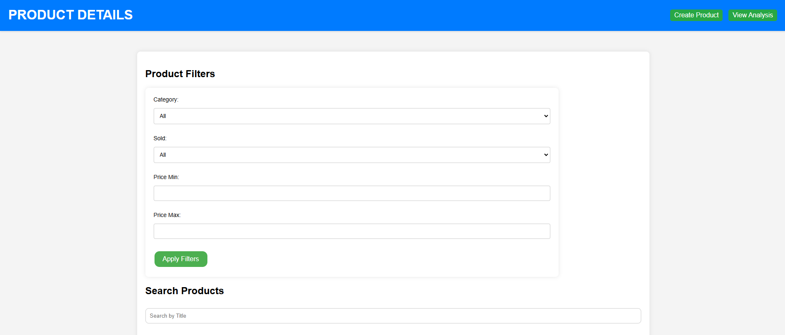
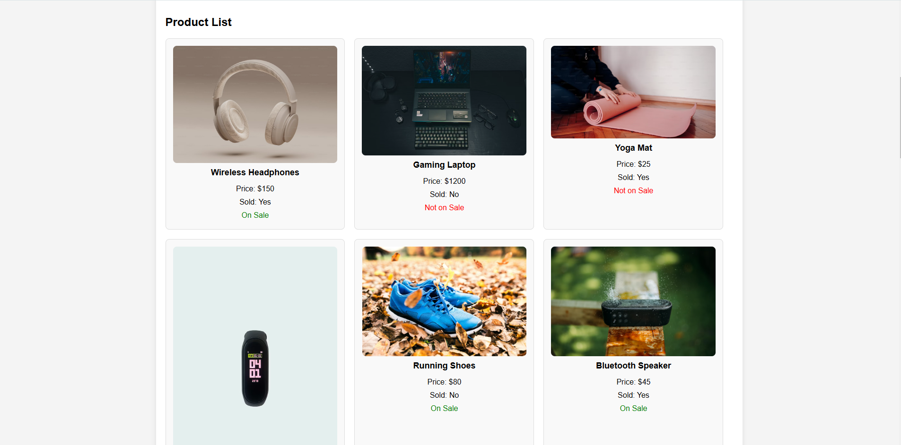
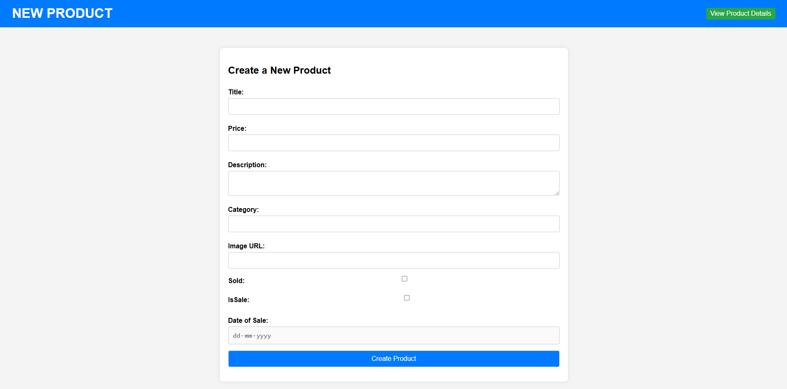

# Product Dashboard

## Project Overview
This project is a full-stack application for managing and analyzing product data. The application fetches product information, stores it in a database, and provides a user-friendly interface for visualization, filtering, and analysis.

### Features:
1. **Data Management**: Populate the database with product details.
2. **Product Table**: Display products in a tabular format with relevant details and styling.
3. **Filters and Search**: Allow users to filter and search products by various criteria.
4. **Graphical Analysis**: Visualize sales and inventory trends using responsive and intuitive graphs.
5. **Deployment**: Fully deployable project with a live demo link.

---

## Instructions to Run the Project Locally

### Prerequisites:
- **Backend**: Ensure you have Node.js installed.
- **Frontend**: Install Node.js and npm/yarn.
- **Database**: MongoDB database used.
- **Others**: Install any other required dependencies.

### Steps:

1. **Clone the Repository:**
   ```bash
   git clone https://github.com/kanishka-mishra/product-api.git

   ```

2. **Setup:**
   - Navigate to the backend folder:
     ```bash
      cd product-api
     ```
   - Install dependencies:
     ```bash
     npm install
     ```
   - Start the server:
     ```bash
     node server.js 
     ```

4. **Access the Application:**
   - Open your browser and visit `http://localhost:9000` for the frontend.

---

## Deployed Link
- Access the live application here: http://localhost:9000/product-details.html
- mongodb json data: http://localhost:9000/products

---

## Deployment Process

This project is deployed using **Amazon EC2** service. Below are the steps followed for deployment:

### Steps:
1. **Setup an EC2 Instance:**
   - Launch an EC2 instance using the AWS Management Console.
   - Choose an appropriate instance type (e.g., t2.micro for small applications).
   - Configure security groups to allow HTTP, HTTPS, and SSH access.

2. **Install Required Software:**
   - Connect to the instance using SSH:
     ```bash
     ssh -i <your-key-file.pem> ec2-user@<your-instance-public-ip>
     ```
   - Update the system packages:
     ```bash
     sudo yum update -y
     ```
   - Install Node.js, Python, or other required software:
     ```bash
     sudo yum install nodejs npm python3
     ```

3. **Deploy the Application:**
   - Clone the project repository on the EC2 instance:
     ```bash
     git clone <repository-url>
     cd <repository-folder>
     ```
   - Install backend and frontend dependencies as described in the local setup instructions.
   - Configure environment variables if needed.

4. **Start the Application:**
    - node server.js

5. **Set Up Domain and SSL:**
   - Configure a domain name and set up SSL using AWS Certificate Manager or Let's Encrypt.

---

## Screenshots
1. **Product Table**
   ---
   
   ---
   
   ---
2. **Filters and Search**
   ---
   
   ---

4. **Graphs**
   

---

## Project Structure

### Backend:
- **Framework**: /Node.js
- **Features**:
  - API endpoints
  - Proper database schema design
  - Filtering and search functionalities

### Frontend:
- **Framework**: React
- **Features**:
  - Responsive and intuitive design
  - Tabular data display with color coding
  - Graphical representations

---

## Graphical Analysis
1. **Category-Wise Sales Amount (Monthly)**
   - Bar graph comparing sales amounts for each category.

2. **Total Items in Each Category (Monthly)**
   - Line chart showing inventory trends.

---

